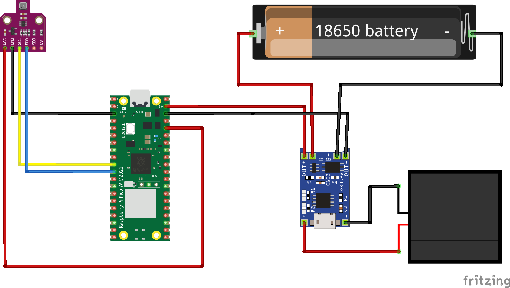

# Sensor for a Greenhouse

This project aims to build a sensor for a greenhouse using a [Raspberry Pi Pico W](https://www.raspberrypi.org/products/raspberry-pi-pico/), a [BME680 environmental sensor](https://www.bosch-sensortec.com/products/environmental-sensors/gas-sensors/bme680/), and a solar panel for power.

The Raspberry Pi Pico will read data from the BME680 sensor, which measures temperature, humidity, gas resistance, and air pressure. The collected sensor data will then be published to an MQTT broker.



**Important note**: The current schematics use **VSYS** to power the Pico with the battery. **This is unsafe**. If the Pico is simultaneously connected to the battery and to an external power supply (like a computer) via USB, it will suffer damage. To avoid this situation, we need to use a schottky diode, such as the 1N5817.

## Setting it up

List of components:

- Raspberry Pi Pico W
- [BME680 sensor](https://www.tinytronics.nl/en/sensors/air/pressure/bme680-sensor-module-with-level-converter-air-pressure-air-quality-humidity-temperature)
- [TP4056 Module](https://www.tinytronics.nl/en/power/bms-and-chargers/li-ion-and-li-po/with-protection-circuit/tp4056-usb-c-li-ion-charger-1a-with-li-ion-protection-circuit) for the battery and solar panel.
- [18650 rechargable battery](https://www.tinytronics.nl/en/power/batteries/18650/eve-18650-li-ion-battery-3100mah-10a-inr18650-33v) and [battery holder](https://www.tinytronics.nl/en/power/battery-holders-and-clips/18650/1x-18650-battery-holder-with-loose-wires-button-top)
- Solar panel with a 5.5mm male jack
- [Female 5.5mm Jack](https://www.tinytronics.nl/en/cables-and-connectors/connectors/screw-terminals/dc-jack-female-5.5mm-to-terminal-block)

Install the latest [Circuit Python release](https://circuitpython.org/downloads) release. The required libraries can be installed in the Pico using [circup](https://github.com/adafruit/circup):

```bash
circup install adafruit-circuitpython-logging
circup install adafruit-circuitpython-minimqtt
circup install adafruit-circuitpython-bme680
```

After setting up the circuit, use your favourite tool to copy the [code.py](./code.py) file to the Pico, including a `settings.toml` file with the WiFi and MQTT configuration.

## Settings

For connecting the Pico to your WiFi and publishing the data via MQTT, make sure to create a `settings.toml` file in your Pico with the following keys and values:

```toml
# WiFi configuration
CIRCUITPY_WIFI_SSID = ""
CIRCUITPY_WIFI_PASSWORD = ""

# MQTT configuration
MQTT_BROKER = ""
MQTT_PORT = 1883
MQTT_USERNAME = ""
MQTT_PASSWORD = ""
```

## Home Assistant configuration

The following configuration is placed in `homeassistant/configuration.yaml` and associates the topic `greenhouse/sensor` with a sensor that can be displayed in your dashboards.

```yaml
mqtt:
  sensor:
    - name: "Temperature"
      state_topic: "greenhouse/sensor"
      unit_of_measurement: "°C"
      value_template: "{{ value_json.temperature }}"
    - name: "Humidity"
      state_topic: "greenhouse/sensor"
      unit_of_measurement: "%"
      value_template: "{{ value_json.humidity }}"
    - name: "Gas"
      state_topic: "greenhouse/sensor"
      unit_of_measurement: "ohms"
      value_template: "{{ value_json.gas }}"
    - name: "Pressure"
      state_topic: "greenhouse/sensor"
      unit_of_measurement: "hPa"
      value_template: "{{ value_json.pressure }}"
```

Restart / Quick reload

## TODO

- [ ] Use a schottky diode, such as the 1N5817, between **VSYS** and the **TP4056** module
- [ ] Switch to power on/off the whole circuit
- [ ] A proper case
- [ ] Monitor battery charge via the Pico, and include it on the MQTT message

## References

I used, among others, the following tutorials and guides:

- [How to power Raspberry PI Pico with Solar Cells](https://peppe8o.com/raspberry-pi-pico-solar-cells/)
- [Guide to powering the Raspberry Pi Pico](https://penguintutor.com/electronics/pico-power)
- [TP4056A Li-ion Battery Charging/Discharging Module Reference](https://components101.com/modules/tp4056a-li-ion-battery-chargingdischarging-module)
